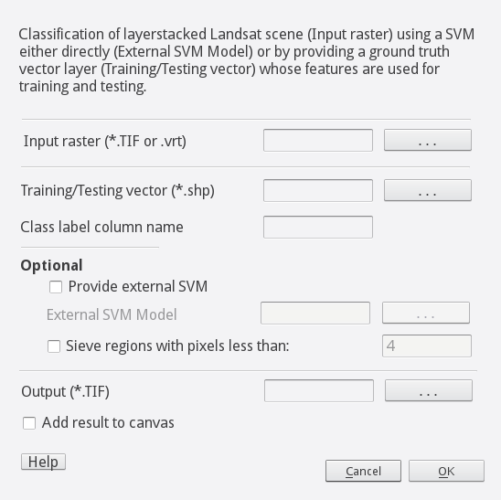

.. SatEx documentation master file, created by
   sphinx-quickstart on Sun Feb 12 17:11:03 2012.
   You can adapt this file completely to your liking, but it should at least
   contain the root `toctree` directive.

Welcome to SatEx's documentation!
============================================

.. toctree::
   :maxdepth: 2

Installation
------------
The plugin can be installed via the QGIS Plugin Manager
or by putting this repository in .qgis2/python/plugins/
and running make deploy from within the repository.

Software Requirements
---------------------
The plugin requires an installation of the Orfeo Toolbox (OTB;
details: www.orfeo-toolbox.org). On Windows you can install it
via OSGeo4W on Linux you can install it from packages provided
by your distribution or build it from the source packages available
from its git repository.

Note: Some Linux distributions split OTB in different packages,
in order for this plugin to work make sure the python wrappers
are installed alongside with the otb library. You can check if OTB
and the wrappers are installed from within qgis by opening the 
Python Console and executing:

.. code-block :: python

   import otbApplication
   otbApplication.Registry.GetAvailableApplications()

This should return you a list of otb functions if it's working.

Purpose of the Plugin
---------------------

Plugin that provides two algorithms for the processing of one or
multiple Landsat scenes within a region of interest towards a
Landuse/Landcoverage classification streamlining all required processing
steps to perform a libsvm/orfeo toolbox (OTB) pixel based
classification.

Structure of the Plugin
-----------------------

The Plugin is structured in two modules:

1. Preprocessing, and

2. Classification

In the **Preprocessing** algorithm Landsat scenes located in a
directory as , e.g., the directory created by extracting from the
downloaded zip archive of a Landsat 8 scene as can be found on
EarthExplorer http://earthexplorer.usgs.gov/ is 1) cropped to a region
of interest provided as , e.g., a polygon feature in a vector file and
then 2) the separate spectral Bands are stacked and 3) a
virtual raster tile is created out of these, i.e., in case the region of
interest stretches over more than one Landsat scene these are virtually mosaiced. 
if present,the panchromatic band 8 (Landsat 7 and 8) is excluded from the layers. The
**Classification** algorithm is performing a classification of a raster
file as, e.g., resulting from the **Preprocessing** algorithm and either
by using a provided trained Support Vector Model (SVM) from OTB or
training and testing a SVM on the fly using a provided ground truth
testing/training data set. In the case a on the fly training/testing is
performed the provided ground truth data is randomly split in a testing
(~20%) and a training part (~80%), the latter is then used in the libsvm
implementation of OTB to create a SVM. This SVM (or the external SVM)
are then used to classify the image. The resulting raster file with
class labels is then tested with the testing dataset (all features of
the provided vector layer in case an external SVM model was provided)
and a confusion matrix is produced. Finally the resulting raster file is
sieved (i.e., regions consisting of view pixels are merged to the
surrounding).

Instructions on plugin usage
----------------------------

Preparation outside the plugin
~~~~~~~~~~~~~~~~~~~~~~~~~~~~~~

1. Create a vector layer with a feature containing your region of
interest as a polygon and save it in ESRI shapefile format. We will
refer to this file as **ROI vector**.

2. Download the Landsat scene(s) from http://earthexplorer.usgs.gov/
(you will need an account - free of cost) covering your region of
interest.

3. Extract the dowloaded archive of the scene. Note: In case you use
several scenes for your region of interest merge the resulting
directories into one, i.e., all \*.TIF files corresponding to the
different bands of the scenes have to be in a single directory! We will
refer to this as **Band directory**

4. Create a vector layer containing ground truth data in form of
polygons with an attribute containing the labels of your desired classes
within your region of interest. We will refer to this as **Train/Test
vector**.

Preprocessing
~~~~~~~~~~~~~

What to enter
^^^^^^^^^^^^^

The module looks like above. It has three white text fields which can be
edited. In the first text field *Directory Landsat bands* you have to
specify the path to the **Band directory** (see section Preparation
outside the plugin), alternatively you can use the button with the three
dots next to the text field to open a file browser to search for the
file. In the second textfield *Input ROI (shp)* you have to provide the
location of the **ROI vector** (see section *Preparation outside the
plugin*). In the last text field *Output (vrt)* you can specify the
location and filename of the virtual raster tile the module will
produce. If you tick the checkbox *Add result to canvas* the resulting
output will be added to your QGIS layers. Finally run the module by
clicking the *OK* Button. Close the dialog without running it via the
*Close* Button.

**Note:** Depending on the machine you are using and the size of your
ROI, the processing might take some time and during that time QGIS might
be non-responsive.

What happens
^^^^^^^^^^^^

The module will first check the number of different scenes that are
present in the **Band directory** and then crop each band for each scene
to the region of interest as specified by **ROI vector** (checking that
they at least partly overlap) and stack the bands into a single
file for each of the scenes. These files are created in the same directory
as you specified for the output virtual raster tile *Output (vrt)* 
with a file suffix like *\*\_satex\_mul.TIF*. Finally, they
are virtually stitched together in the file that is specified in the
text field *Output (vrt)*.

**Note:** The resulting \*.vrt file only links the *\*\_satex\_mul.TIF*
files created in the **Band directory** and does not contain the actual
data! If you need to transfer the file save it as a regular \*.TIF file!

Classification
~~~~~~~~~~~~~~

What to enter
^^^^^^^^^^^^^

The module looks like above. It has four white text fields which can be
edited. In the first text field *Input raster (\*.TIF or .vrt)* the
location of the file to be classified has to be defined (e.g. the
virtual raster tile resulting from the **Preprocessing** module) ,
alternatively you can use the button with the three dots next to the
text field to open a file browser to search for the file. In the second
textfield *Training/Testing vector (\*.shp)* you have to provide the
location of the **Training/Testing vector** (see section *Preparation
outside the plugin*). In the fourth text field Class label column name
you have to specify the name of the column in your **Training/Testing
vector** that holds the labels of your classes. If you already have a
OTB Support Vector model from, e.g., another region, and you like to use
this one for the classification rather than training a new one, you can
tick *Provide external SVM* and specify the location of this model in
the text field *External SVM Model*. In the text field **Output (\*.TIF)**
you have to specify the location and file name of the resulting raster
file containing the class labels. In case you want to remove small
classification regions, e.g., consisting of only 4 pixels and merge
these with the largest neighboring regions tick the option *Sieve result
for regions with pixels less than* and specify the minimum number of
pixels to remain in the output in the text field next to it. If you tick
the checkbox *Add result to canvas* the resulting output will be added
to your QGIS layers.

What happens
^^^^^^^^^^^^

The module distinguishes two cases. If you provided an external SVM
model, the provided image is classified using this model and, not-empty,
all provided features in the **Training/Testing vector** are used for
testing (making sure that all features are covered by the raster file).
You will find a csv file containing the Confusion Matrix created in the
same location as your **Training/Testing vector** with the same name,
but ending with *\*\_CM.csv* instead of *\*.shp*. In the second case
where no external SVM model is provided the **Training/Testing vector**
will be split in two files at the same location as the
**Training/Testing vector** and with the same name, but ending with
*\*\_test.shp* and *\*\_train.shp*, respectively. The splitting is done
with the fix ratio of features of ~80% training and ~20% testing data
with the same number of feature samples (at least one) from each class (
**Note:** The number of pixels in each of the sets depends on the size
of the features and is not controlled). The features of the
*\*\_train.shp* file are then used to train a SVM based on the libsvm
implementation of OTB. The resulting model created at the location of
the **Training/Testing vector** and with the same name, but ending with
*\*\_svmModel.svm* is then used to classify the *Input raster*. The
features of the *\*\_test.shp* file are then used to calculate a
Confusion Matrix at the same location as the **Training/Testing vector**
and the same name, but ending with *\*\_CM.csv* instead of *\*.shp*.

LICENSE
-------
Copyright (c) 2016, GFZ - Centre for Early Warning
All rights reserved.

Redistribution and use in source and binary forms, with or without
modification, are permitted provided that the following conditions are met:

* Redistributions of source code must retain the above copyright notice, this
  list of conditions and the following disclaimer.

* Redistributions in binary form must reproduce the above copyright notice,
  this list of conditions and the following disclaimer in the documentation
  and/or other materials provided with the distribution.

* Neither the name of REM_satex_plugin nor the names of its
  contributors may be used to endorse or promote products derived from
  this software without specific prior written permission.

THIS SOFTWARE IS PROVIDED BY THE COPYRIGHT HOLDERS AND CONTRIBUTORS "AS IS"
AND ANY EXPRESS OR IMPLIED WARRANTIES, INCLUDING, BUT NOT LIMITED TO, THE
IMPLIED WARRANTIES OF MERCHANTABILITY AND FITNESS FOR A PARTICULAR PURPOSE ARE
DISCLAIMED. IN NO EVENT SHALL THE COPYRIGHT HOLDER OR CONTRIBUTORS BE LIABLE
FOR ANY DIRECT, INDIRECT, INCIDENTAL, SPECIAL, EXEMPLARY, OR CONSEQUENTIAL
DAMAGES (INCLUDING, BUT NOT LIMITED TO, PROCUREMENT OF SUBSTITUTE GOODS OR
SERVICES; LOSS OF USE, DATA, OR PROFITS; OR BUSINESS INTERRUPTION) HOWEVER
CAUSED AND ON ANY THEORY OF LIABILITY, WHETHER IN CONTRACT, STRICT LIABILITY,
OR TORT (INCLUDING NEGLIGENCE OR OTHERWISE) ARISING IN ANY WAY OUT OF THE USE
OF THIS SOFTWARE, EVEN IF ADVISED OF THE POSSIBILITY OF SUCH DAMAGE.

Contact
----------------

Michael Haas, mhaas@gfz-potsdam.de
Massimiliano Pittore, pittore@gfz-potsdam.de

GFZ German Research Centre for Geosciences - Centre for Early Warning
Systems

Date: January 27, 2016
